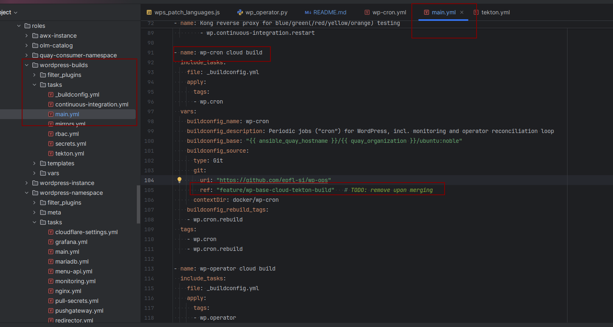

```
pip install -r requirements.txt
pip install -r requirements_dev.txt

python3 test/mock_pushgateway.py
```
Login into OKD and then:
```
export K8S_NAMESPACE=wordpress-test
export DEBUG=1
python3 wp-cron.py --pushgateway=localhost:8083
```

## To build wp-cron manually
Change version in wp-ops/ansible/roles/wordpress-namespace/tasks/wp-cron.yml
`make -C ~/dev/wp-dev-nginx wp-base wp-cron wp-cron-push && wpsible -t wp.cron [--prod]`

## To build on OS4
`wpsible -t wp.cron.rebuild`
`wpsible -t wp.cron [--prod]`

## To deploy a new version
- If we are on a specific branch on wp-ops, we need to specify it on /wp-ops/ansible/roles/wordpress-builds/tasks/main.yml in the "wp-cron cloud build" task, by using "ref" property:

Then form wp-ops: `wpsible -t wp.cron.rebuild`
- If we want to build from master branch:
  - `wpsible -t wp.cron.rebuild` (without changing anything) or go into the [buildConfig/wp-cron](https://console-openshift-console.apps.ocpitst0001.xaas.epfl.ch/k8s/ns/svc0041t-wordpress/buildconfigs/wp-cron/builds) and start build:
      
